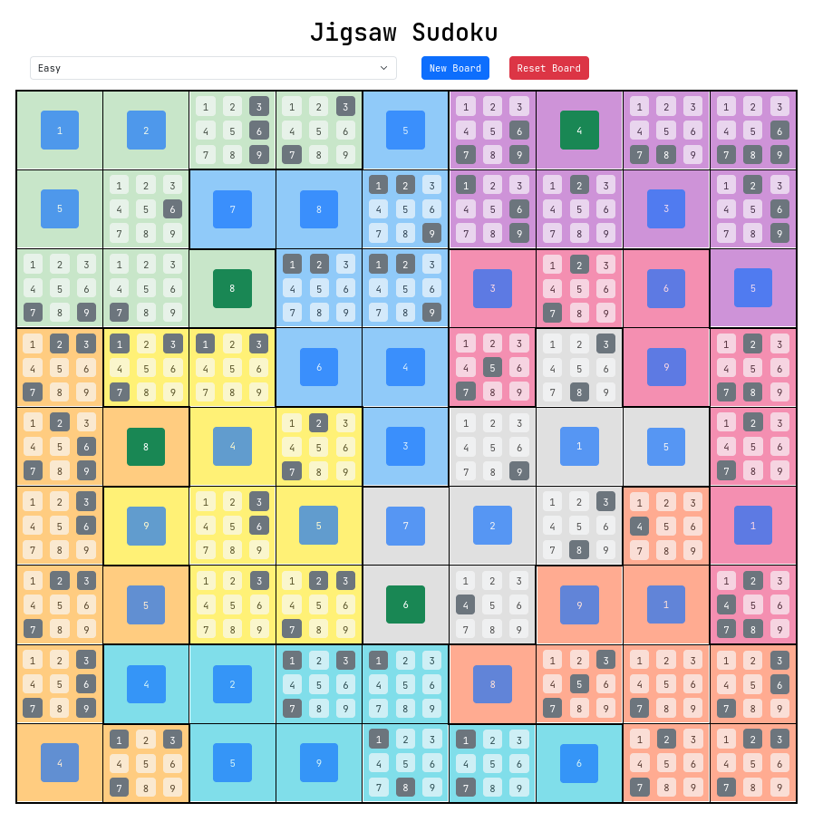
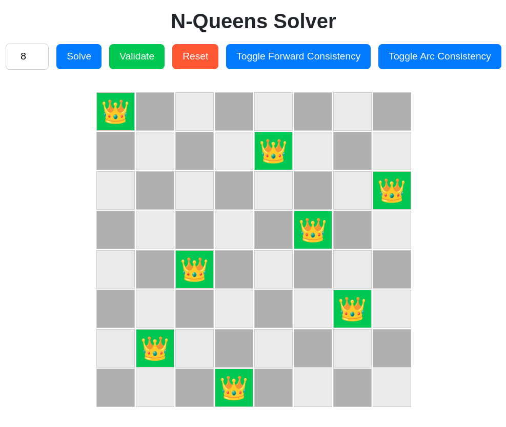

# Jigsaw Sudoku and N-Queens Solver

Welcome to the Jigsaw Sudoku and N-Queens Solver application! This web-based app allows users to play and solve two classic puzzles: **Jigsaw Sudoku** and **N-Queens**. Designed with modern web technologies, the application provides an interactive and engaging user experience.

---

## 🚀 Features

- **Jigsaw Sudoku**: Play and solve puzzles with varying difficulty levels.
- **N-Queens**: Solve the N-Queens puzzle and visualize the solution.
- **Dynamic Board Generation**: Boards are dynamically generated based on predefined configurations.
- **Interactive UI**: A user-friendly and responsive interface.
- **Victory Celebration**: Celebrate your wins with confetti and a congratulatory message.

---

## 📂 Code Explanation

### 🔢 Jigsaw Sudoku

- **Components**:
  - `Board`: Renders the Sudoku board and manages game logic.
  - `Square`: Represents one of the 81 squares in the board.
  - `Island`: Represents a single coloured region on the board
  - `NumBox`: Represents individual cells in a square.
- **Implementation**:

  - **Board Generation**: Boards are generated using predefined configurations in `PredefinedBoards.ts`. The `generateInitialJigsawBoard` function initializes the board, filling a percentage of cells.

    - **Solver**: The `solveJigsawSudoku` function employs a **backtracking algorithm** to solve the puzzle, ensuring all placements follow Sudoku rules.

### 🖼️ Jigsaw Sudoku Image

  

---

### 👑 N-Queens

- **Component**:

  - `NQBoard`: Handles rendering and logic for the N-Queens board.

- **Implementation**:

  - **Solver**: The `solveNQueens` function uses **Forward Checking** & **Arc Consistency** to place queens while ensuring no conflicts. Solutions are visualized, showing the placement of queens.

- 🖼️ **N-Queens Image**

  

    
  

---

## 🛠️ Tech Stack

- **React**: For building the user interface.
- **TypeScript**: For type-safe development.
- **Vite**: For fast development and build tooling.
- **Bootstrap**: For styling and responsiveness.
- **ESLint**: For code linting and quality assurance.

---

## 🧠 Algorithms

### Jigsaw Sudoku Solver

- Utilizes a **backtracking algorithm**:
  1. Attempts to place numbers in empty cells.
  2. Ensures placements are valid according to Sudoku rules.
  3. Backtracks if a dead end is reached and tries another number.

### N-Queens Solver

- Also employs a **Forward Checking** & **Arc Consistency algorithm**:
  1. Places queens row by row.
  2. Ensures no two queens threaten each other.
  3. Backtracks if a dead end is reached and tries another position.

---

## 🌟 Future Improvements

- Add more puzzle types (e.g., Kakuro, KenKen).
- Implement user authentication for saving progress and leaderboards.
- Provide hints and tips to assist users.
- Optimize for mobile devices for a seamless experience.
- Enhance performance for faster solving times.

---

## 📧 Feedback and Contributions

We hope you enjoy solving these classic puzzles with our application! If you have suggestions, feedback, or want to contribute, feel free to reach out. Let's make puzzling fun together!

**Happy Puzzling!**
